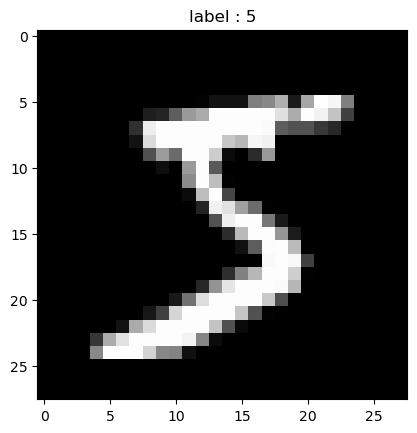

```python
## 선형회귀
import torch ## what? pytorch 라이브러리 임포트
import torch.nn as nn ## pytorch 라이브러리에 있는 신경망 구성요소 import nn = neural network
import torch.optim as optim ## pytorch 라이브러리에 있는 최적화 함수들 import, optim = optimizer
import torch.nn.functional as F ## 신경망 관련 함수(loss) import
```


```python
## 데이터 -> pytorch는 tensor 사용
## 선형적인 데이터 선언 -> (1, 2), (2, 4), (3, 6) 그렇다면 인풋과 아웃풋이 어떻게 돼야하나? 
## 인풋의 예시는 1이 들어오면 아웃풋이 2가 나와야 한다.
## 모델의 가중치의 형식은 어떻게 돼야 할까? 입력이 3x1이고 아웃풋도 3x1이니 가중치는 1x1, 마찬가지로 바이어스도 1x1이어야 한다. 그러면 출력이 3x1이 될 것이다.
x_train = torch.FloatTensor([[1], [2], [3]]) 
y_train = torch.FloatTensor([[2], [4], [6]])
```


```python
## 모델 만들기
class LinearRegression(nn.Module):
    def __init__(self):
        super(LinearRegression, self).__init__() ## 왜 super 형식이 이렇게 되지? 무슨 일이 일어나는 거지?
        self.linear = nn.Linear(1, 1) ## 왜 인자가 1,1 인가? 
        
    def forward(self ,x):
        return self.linear(x)
    

        
```


```python
# 에포크, 손실함수, 최적화 함수 설정

total_epoch = 2000

model = LinearRegression()

optimizer = optim.SGD(model.parameters(), lr=1e-2)
```


    ---------------------------------------------------------------------------

    TypeError                                 Traceback (most recent call last)

    Cell In[16], line 5
          1 # 에포크, 손실함수, 최적화 함수 설정
          3 total_epoch = 2000
    ----> 5 model = LinearRegression()
          7 optimizer = optim.SGD(model.parameters(), lr=1e-2)


    Cell In[15], line 4, in LinearRegression.__init__(self)
          3 def __init__(self):
    ----> 4     super(self, LinearRegression).__init__() ## 왜 super 형식이 이렇게 되지? 무슨 일이 일어나는 거지?
          5     self.linear = nn.Linear(1, 1)


    TypeError: super() argument 1 must be type, not LinearRegression


```python
for epoch in range(total_epoch+1):
    output = model(x_train)
    
    cost = F.mse_loss(output, y_train)
    
    optimizer.zero_grad()
    
    cost.backward()
    
    optimizer.step()
    
    if epoch % 100 == 0:
        print("Epoch: {}  Loss: {}".format(epoch, cost.item()))
```

    Epoch: 0  Loss: 3.185126121185711e-11
    Epoch: 100  Loss: 2.4101609596982598e-11
    Epoch: 200  Loss: 2.1088908397359774e-11
    Epoch: 300  Loss: 1.7678303265711293e-11
    Epoch: 400  Loss: 1.6825651982799172e-11
    Epoch: 500  Loss: 1.3718211462621088e-11
    Epoch: 600  Loss: 1.2979247017430584e-11
    Epoch: 700  Loss: 1.2979247017430584e-11
    Epoch: 800  Loss: 1.2979247017430584e-11
    Epoch: 900  Loss: 1.2278178473934531e-11
    Epoch: 1000  Loss: 1.2278178473934531e-11
    Epoch: 1100  Loss: 1.2278178473934531e-11
    Epoch: 1200  Loss: 1.2278178473934531e-11
    Epoch: 1300  Loss: 1.2278178473934531e-11
    Epoch: 1400  Loss: 1.2278178473934531e-11
    Epoch: 1500  Loss: 1.2278178473934531e-11
    Epoch: 1600  Loss: 1.2278178473934531e-11
    Epoch: 1700  Loss: 1.2278178473934531e-11
    Epoch: 1800  Loss: 1.2278178473934531e-11
    Epoch: 1900  Loss: 1.2278178473934531e-11
    Epoch: 2000  Loss: 1.2278178473934531e-11


```python
m = nn.Linear(20, 30) 
input = torch.randn(128, 20) 
output = m(input) 
print(output.size())
print(m.weight)
print(m.bias)
```

    torch.Size([128, 30])
    Parameter containing:
    tensor([[-0.1286,  0.0123, -0.0336,  0.1260, -0.0311, -0.1110, -0.1032,  0.2138,
             -0.1472,  0.0565, -0.1051, -0.0808, -0.2172,  0.1564,  0.2032, -0.1050,
             -0.0203,  0.1608,  0.0788,  0.0643],
            [-0.1803,  0.1921,  0.0473,  0.1535,  0.1238, -0.1081, -0.0996,  0.2207,
             -0.0972, -0.0353, -0.1556, -0.1671,  0.0912,  0.0817,  0.0977, -0.1423,
             -0.0986,  0.0885, -0.1508,  0.0549],
            [-0.1791,  0.0227,  0.2174, -0.0562, -0.0714, -0.1652, -0.0226,  0.0383,
             -0.1805, -0.1288, -0.1676,  0.0570, -0.0422, -0.1121, -0.2057,  0.1444,
             -0.0719,  0.1077,  0.1140,  0.0406],
            [ 0.1623, -0.0430, -0.0770, -0.0043,  0.1617,  0.0716, -0.1241,  0.0130,
             -0.1434,  0.0909, -0.2226, -0.0710,  0.0712, -0.0824,  0.1602, -0.1986,
              0.1067,  0.1848, -0.0823,  0.1360],
            [ 0.0152,  0.0118,  0.1434,  0.0448, -0.1405, -0.1253, -0.0076, -0.1100,
              0.0150,  0.1687, -0.1166, -0.1302,  0.1132, -0.0767, -0.0651, -0.0339,
              0.1044,  0.0496, -0.1898, -0.0603],
            [-0.0112, -0.0165, -0.1333, -0.1632,  0.1495, -0.0963, -0.0893,  0.0157,
             -0.1743, -0.1140, -0.1907, -0.1353,  0.1353, -0.1376,  0.0014, -0.0158,
              0.2213, -0.0443,  0.1443,  0.0636],
            [ 0.0626, -0.1461, -0.1871,  0.0494,  0.1952,  0.0903,  0.1143, -0.0405,
             -0.1495,  0.1921,  0.0940,  0.1626, -0.0024, -0.1401, -0.1220, -0.0063,
             -0.2201, -0.0285, -0.1396, -0.1506],
            [ 0.1479, -0.1867,  0.1456, -0.1724, -0.0491, -0.1905, -0.1046, -0.2105,
              0.1491,  0.1901, -0.0647,  0.0983, -0.1091, -0.0371, -0.0831, -0.0796,
             -0.1755,  0.1268, -0.2156,  0.0689],
            [ 0.0304,  0.1754, -0.0701, -0.0103, -0.1402,  0.2125, -0.2142, -0.2208,
              0.0544, -0.1829, -0.0686,  0.1038, -0.2152,  0.0583, -0.0442,  0.0822,
              0.0594, -0.0995, -0.0186, -0.1175],
            [ 0.0833, -0.1850, -0.0800, -0.1515, -0.1350,  0.1739, -0.1558, -0.1160,
              0.0153, -0.1062,  0.0112, -0.1300,  0.1752,  0.0399,  0.0739,  0.0042,
              0.0591,  0.0556, -0.0737, -0.1650],
            [ 0.1547,  0.1494, -0.0735, -0.1686, -0.0967,  0.1969, -0.0475, -0.1165,
             -0.1122, -0.1278,  0.0234, -0.1395,  0.0668,  0.0737,  0.0233, -0.1917,
              0.0067,  0.1458,  0.0940,  0.0661],
            [ 0.0420, -0.2065,  0.0651, -0.1687, -0.2122, -0.0776,  0.1630,  0.1276,
             -0.0146,  0.1651,  0.1131,  0.1064, -0.0174,  0.0728,  0.1080,  0.0279,
             -0.1380, -0.0018, -0.0039, -0.1629],
            [-0.0186,  0.2031,  0.0883, -0.2189, -0.1543, -0.1231,  0.0451, -0.0717,
             -0.0165,  0.0267, -0.0010,  0.2014, -0.1183,  0.1398,  0.0633,  0.0778,
              0.0355, -0.2046, -0.1395,  0.1612],
            [-0.0930, -0.0051, -0.0689, -0.0932,  0.1416,  0.0748,  0.0087, -0.0989,
             -0.0969,  0.1355, -0.2162, -0.2047,  0.1901, -0.0451, -0.1876,  0.1836,
              0.2132, -0.1178,  0.1871, -0.0092],
            [-0.1892,  0.2061,  0.0327,  0.0497, -0.2067,  0.1962,  0.2193,  0.0779,
             -0.1118,  0.0146,  0.1808,  0.1836, -0.0773, -0.1276, -0.1272,  0.2200,
             -0.0258, -0.0134, -0.1075,  0.0258],
            [ 0.0273, -0.1877,  0.0626,  0.1052, -0.1816,  0.2166, -0.0874, -0.0416,
              0.1471,  0.1283, -0.0315, -0.1519, -0.0275,  0.2194, -0.0530,  0.0624,
              0.0812, -0.2096, -0.1655,  0.0058],
            [ 0.1354, -0.1895, -0.1204,  0.1526,  0.1445,  0.1946,  0.0956,  0.2068,
              0.1899, -0.1670, -0.1111,  0.2172, -0.1177,  0.1836, -0.1771, -0.2112,
              0.2205, -0.1901,  0.1704,  0.1882],
            [-0.1941,  0.1620, -0.2143, -0.0927,  0.2077, -0.0669,  0.1710,  0.1843,
             -0.1683, -0.0773, -0.0144,  0.1666, -0.2072, -0.1325,  0.1772,  0.1134,
              0.0170, -0.0176,  0.0564, -0.1978],
            [ 0.1228,  0.1867, -0.1186, -0.1075,  0.1577,  0.2063,  0.1733, -0.0278,
              0.1426,  0.0901,  0.2073, -0.1142,  0.0870, -0.0516,  0.1093, -0.0025,
             -0.0693, -0.0372,  0.0037, -0.0947],
            [ 0.0903,  0.1914, -0.0762, -0.0947, -0.2051, -0.1796,  0.0361,  0.1001,
             -0.1817, -0.0141, -0.2027,  0.0074, -0.1163, -0.1402,  0.0029, -0.2104,
              0.0314,  0.1531,  0.1494,  0.0116],
            [ 0.0697, -0.1017,  0.1143,  0.1992,  0.0921, -0.0941,  0.0041,  0.2070,
              0.1041,  0.1163, -0.0251, -0.0318, -0.0695,  0.1350,  0.1607,  0.1805,
             -0.0544,  0.1652,  0.2080,  0.1686],
            [-0.1449,  0.1576, -0.1582, -0.0437,  0.1924,  0.0585, -0.1235,  0.0998,
              0.0480,  0.0885,  0.0387, -0.0728, -0.1697,  0.0521, -0.1672, -0.0555,
              0.2203, -0.1448, -0.1231, -0.1358],
            [ 0.2060,  0.0188, -0.1296, -0.0652,  0.0971, -0.0750,  0.1571,  0.0508,
             -0.2029,  0.0890,  0.1593, -0.0804,  0.0713,  0.2101,  0.2169,  0.1356,
              0.2158,  0.0264, -0.1487,  0.1655],
            [ 0.0215, -0.1973,  0.1394,  0.0818, -0.1382,  0.0993,  0.2133, -0.1493,
              0.0730, -0.0796, -0.0583, -0.1151,  0.1414, -0.1509,  0.2142,  0.0970,
             -0.0302,  0.0438, -0.0628,  0.1611],
            [-0.0697, -0.0218, -0.1141, -0.0835, -0.1821,  0.2001, -0.2209, -0.0361,
             -0.1119,  0.0861, -0.1288,  0.0143,  0.0230,  0.1686, -0.1939, -0.0890,
             -0.0918,  0.1710,  0.0641,  0.0779],
            [ 0.1408,  0.0395, -0.0321, -0.2112, -0.1913,  0.0993,  0.1672, -0.1512,
             -0.0727,  0.0119,  0.0104,  0.1569, -0.1865, -0.0198, -0.1835, -0.0121,
             -0.1572,  0.1964,  0.0191,  0.0406],
            [ 0.0592,  0.0636, -0.0860,  0.0541,  0.1700, -0.0926,  0.0073,  0.0925,
              0.2115, -0.2226,  0.2002,  0.0062, -0.0796,  0.0758,  0.2188, -0.1724,
             -0.1910,  0.1470, -0.1768,  0.1863],
            [ 0.2145, -0.1986, -0.1178,  0.2010,  0.0026, -0.0053, -0.0627, -0.1482,
              0.0597, -0.1787,  0.0849, -0.0972, -0.0013, -0.0683, -0.1286, -0.0419,
             -0.0269,  0.1616,  0.1898, -0.0725],
            [-0.0121, -0.0824,  0.1113,  0.0179,  0.1954, -0.0093, -0.1838, -0.1681,
              0.1830,  0.0839,  0.1464, -0.2115, -0.2104, -0.2079, -0.1210,  0.0806,
             -0.2165, -0.1631, -0.2159,  0.0415],
            [ 0.2079,  0.0236,  0.0196,  0.1567,  0.1349, -0.0152,  0.1554, -0.1030,
              0.0699,  0.0339, -0.2163,  0.1779, -0.0409, -0.1906, -0.0877,  0.0025,
              0.0974, -0.1179,  0.0420,  0.1072]], requires_grad=True)
    Parameter containing:
    tensor([ 0.0763, -0.1518, -0.0453,  0.1429, -0.1293,  0.1385, -0.0196,  0.1461,
             0.0377, -0.2153, -0.0186,  0.0638, -0.1868,  0.2024,  0.1745,  0.1164,
            -0.2175, -0.2148, -0.1018, -0.1542, -0.1705,  0.0637,  0.1664,  0.0809,
             0.0641, -0.1925,  0.0011, -0.1232,  0.0732, -0.1951],
           requires_grad=True)


```python
input = torch.FloatTensor([7])
output = model.forward(input)
print(output)
```


    ---------------------------------------------------------------------------

    TypeError                                 Traceback (most recent call last)

    Cell In[20], line 2
          1 input = torch.FloatTensor([7])
    ----> 2 output = model.forward(input)
          3 print(output)


    TypeError: forward() missing 1 required positional argument: 'x'


```python
## super

class Parent: ## 클래스 선언
    def __init__(self, name): ## 생성자, 객체 생성 시 한번 호출, 이때 name을 인자로 받음
        self.name = name
    
    
class Child(Parent): ## Child 클래스로 Parent 상속 받음
    def __init__(self, name, age): ## Child 객체 생성시 생성자 호출, name과 age를 인자로 받음 
        super().__init__(name) ## Parent 생성자 호출
        self.age = age
        

child = Child("Alice", 5)

print(child.age)

print(child.name)
```

    5
    Alice


```python
class Person:
    def __init__(self, name, age):
        self.name = name
        self.age = age

    def get_name(self):
        print(f'제 이름은 {self.name}입니다.')
    
    def get_age(self):
        print(f'제 나이는 {self.age}세 입니다.')
        
        
class Student(Person):
    def __init__(self, name, age, GPA):
        super().__init__(name, age)
        self.GPA = GPA

    def get_GPA(self):
        print(f'제 학점은 {self.GPA}입니다.')
        
s1 = Student("lsh", 24, 4.5)

print(s1.age)
print(s1.GPA)
print(s1.name)
```

    24
    4.5
    lsh


```python
# 다층 퍼셉트론으로 MNIST 분류

import torch
import torch.nn as nn
import torch.optim as optim
import torchvision.datasets as datasets
import torchvision.transforms as transforms
from torch.utils.data import DataLoader

# GPU를 사용할 수 있다면 사용합니다.
device = torch.device('cuda' if torch.cuda.is_available() else 'cpu')

# 하이퍼파라미터 정의
input_size = 784  # 28x28 픽셀
hidden_size = 128
num_classes = 10
learning_rate = 0.001
batch_size = 64
num_epochs = 10

# MNIST 데이터셋 로드
train_dataset = datasets.MNIST(root='data/',
                               train=True,
                               transform=transforms.ToTensor(),
                               download=True)

test_dataset = datasets.MNIST(root='data/',
                              train=False,
                              transform=transforms.ToTensor())

# 데이터 로더 생성
train_loader = DataLoader(dataset=train_dataset,
                          batch_size=batch_size,
                          shuffle=True)

test_loader = DataLoader(dataset=test_dataset,
                         batch_size=batch_size,
                         shuffle=False)

# 다층 퍼셉트론 모델 정의
class MLP(nn.Module):
    def __init__(self, input_size, hidden_size, num_classes):
        super(MLP, self).__init__()
        self.fc1 = nn.Linear(input_size, hidden_size)
        self.relu = nn.ReLU()
        self.fc2 = nn.Linear(hidden_size, num_classes)
    
    def forward(self, x):
        out = self.fc1(x)
        out = self.relu(out)
        out = self.fc2(out)
        return out

# 모델 생성 및 손실함수, 최적화 함수 정의
model = MLP(input_size, hidden_size, num_classes).to(device)
criterion = nn.CrossEntropyLoss()
optimizer = optim.Adam(model.parameters(), lr=learning_rate)

# 학습 루프
for epoch in range(num_epochs):
    for batch_idx, (data, targets) in enumerate(train_loader):
        data = data.to(device=device)
        targets = targets.to(device=device)
        
        # 순전파
        scores = model(data.reshape(-1, 28*28))
        loss = criterion(scores, targets)
        
        # 역전파 및 가중치 업데이트
        optimizer.zero_grad()
        loss.backward()
        optimizer.step()
        
    print(f'Epoch [{epoch+1}/{num_epochs}], Loss: {loss.item():.4f}')

# 테스트 루프
def test(loader, model):
    num_correct = 0
    num_samples = 0
    model.eval()
    
    with torch.no_grad():
        for data, targets in loader:
            data = data.to(device=device)
            targets = targets.to(device=device)
            
            # 순전파
            scores = model(data.reshape(-1, 28*28))
            _, predictions = scores.max(1)
            
            # 정확도 계산
            num_correct += (predictions == targets).sum()
            num_samples += predictions.size(0)
    
    accuracy = float(num_correct) / float(num_samples) * 100
    print(f'Accuracy: {accuracy:.2f}')

test(train_loader, model)
test(test_loader, model)
```

    Epoch [1/10], Loss: 0.3752
    Epoch [2/10], Loss: 0.1055
    Epoch [3/10], Loss: 0.0345
    Epoch [4/10], Loss: 0.1355
    Epoch [5/10], Loss: 0.0701
    Epoch [6/10], Loss: 0.0227
    Epoch [7/10], Loss: 0.0108
    Epoch [8/10], Loss: 0.0040
    Epoch [9/10], Loss: 0.0441
    Epoch [10/10], Loss: 0.0024
    Accuracy: 99.55
    Accuracy: 97.59


```python
## CNN 으로 분류
import torch
import torch.nn as nn 
import torch.nn.functional as F
import torch.optim as optim 
from torchvision import datasets, transforms 

from matplotlib import pyplot as plt


```


```python
is_cuda = torch.cuda.is_available()
device = torch.device('cuda' if is_cuda else 'cpu')

print('Current cuda device is', device)
```

    Current cuda device is cuda


```python
batch_size = 50
learning_rate = 1e-4
epoch_num = 15
```


```python
train_data = datasets.MNIST(root = './data', train=True, download=True, transform = transforms.ToTensor())
test_data = datasets.MNIST(root = './data', train=False, download=True, transform=transforms.ToTensor())
```


```python
print(len(train_data))
print(len(test_data))
```

    60000
    10000


```python
image, label = train_data[0]
plt.imshow(image.squeeze().numpy(), cmap='gray')
plt.title('label : %s' % label)
plt.show()
```


    

    


```python
print(image.shape)
```

    torch.Size([1, 28, 28])


```python
#### -- 2-3. Mini-Batch 구성하기 -- ####
train_loader = torch.utils.data.DataLoader(dataset = train_data, 
                                           batch_size = batch_size, shuffle = True)
test_loader  = torch.utils.data.DataLoader(dataset = test_data, 
                                           batch_size = batch_size, shuffle = True)

first_batch = train_loader.__iter__().__next__()
print('{:15s} | {:<25s} | {}'.format('name', 'type', 'size'))
print('{:15s} | {:<25s} | {}'.format('Num of Batch', '', len(train_loader)))
print('{:15s} | {:<25s} | {}'.format('first_batch', str(type(first_batch)), len(first_batch)))
print('{:15s} | {:<25s} | {}'.format('first_batch[0]', str(type(first_batch[0])), first_batch[0].shape))
print('{:15s} | {:<25s} | {}'.format('first_batch[1]', str(type(first_batch[1])), first_batch[1].shape))
```

    name            | type                      | size
    Num of Batch    |                           | 1200
    first_batch     | <class 'list'>            | 2
    first_batch[0]  | <class 'torch.Tensor'>    | torch.Size([50, 1, 28, 28])
    first_batch[1]  | <class 'torch.Tensor'>    | torch.Size([50])


```python
class CNN(nn.Module):
    def __init__(self):
        super(CNN, self).__init__()
        self.conv1 = nn.Conv2d(1, 32, 3, 1)
        self.conv2 = nn.Conv2d(32, 64, 3, 1)
        self.dropout1 = nn.Dropout2d(0.25)
        self.dropout2 = nn.Dropout2d(0.5)
        self.fc1 = nn.Linear(9216, 128)
        self.fc2 = nn.Linear(128, 10)
        
    def forward(self, x):
        x = self.conv1(x)
        x = F.relu(x)
        x = self.conv2(x)
        x = F.max_pool2d(x, 2)
        x = self.dropout1(x)
        x = torch.flatten(x, 1)
        x = self.fc1(x)
        x = F.relu(x)
        x = self.dropout2(x)
        x = self.fc2(x)
        output = F.log_softmax(x, dim= 1)
        return output
    
    
```
